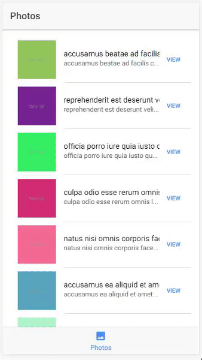

# MavennetQ1
Front end system for displaying photos.



## Getting Started

These instructions will get you a copy of the project up and running on your local machine for development and testing purposes.

### Prerequisites

What things you need to install the software.

* Node v10.1.0

### Installing

A step by step series of examples that tell you how to get a development env running

First install the npm dependencies by running in the root project directory.

```
npm install
```
Then install ionic globally to your computer.

```
npm install ionic -g
```

### Running

To start the server run the following command from the root project directory.

```
ionic serve
```

